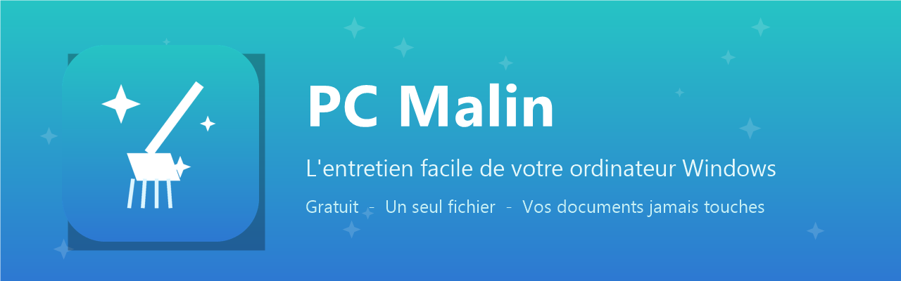

<div align="center">



[](https://github.com/Davy-faugere/pc-malin/releases/latest)
[](https://github.com/Davy-faugere/pc-malin/releases)
[](#-installation)
[](LICENSE)

### 🧹 Redonnez du peps à votre PC — en 3 clics, sans être informaticien.

**[⬇ Télécharger PC Malin](https://github.com/Davy-faugere/pc-malin/releases/latest)** · [Guide d'utilisation](docs/guide.html) · [Signaler un souci](../../issues)

</div>

---

## ✨ Ce qu'il fait

| | Espace | Ce qu'il fait pour vous |
|---|---|---|
| 🖥️ | **Mon ordinateur** | La carte d'identité de votre PC : nom, modèle, Windows, mémoire, espace disque |
| 🧹 | **Faire le ménage** | Corbeille, fichiers temporaires, restes de mises à jour — vidés en un clic, avec le total d'espace récupéré |
| 💚 | **Bilan de santé** | 4 contrôles (disque, mémoire, redémarrage, Internet) en vert / orange / rouge, avec un conseil clair |
| 💡 | **Conseils** | Les 6 réflexes qui évitent 80 % des « ça rame » |

> **🔒 Vos documents, photos et fichiers personnels ne sont JAMAIS touchés.**
> PC Malin ne supprime que les fichiers « poubelle » de Windows. Pas de pub, pas de collecte de données, pas de connexion Internet requise — et tout le code est lisible ici même.

## ⬇ Installation

**1.** Téléchargez la dernière version → **[Releases](https://github.com/Davy-faugere/pc-malin/releases/latest)**

**2.** Choisissez votre format (contenu identique) :

| Format | Pour qui |
|---|---|
| **`PC-Malin.exe`** | Le plus simple — double-clic et c'est parti |
| **`PC-Malin.cmd`** | Les curieux — un fichier texte lisible dans le Bloc-notes avant lancement |

**3.** Windows demande une autorisation (nécessaire pour nettoyer les fichiers système) → **Oui**.

**4.** Installez-le (raccourci sur le Bureau) ou utilisez-le sans rien installer — au choix.

> **Windows SmartScreen ?** Au premier lancement d'un fichier téléchargé, Windows peut afficher « Windows a protégé votre PC » (l'exe n'est pas signé par un certificat commercial). Cliquez sur *Informations complémentaires* → *Exécuter quand même*. Le code que vous exécutez est exactement celui que vous lisez dans ce dépôt — c'est tout l'intérêt de l'open source.

**Désinstallation** : supprimez le raccourci du Bureau et le dossier `C:\ProgramData\PC Malin`. C'est tout.

## 🛠️ Sous le capot

```
src/
  pcmalin.ps1    # L'application (PowerShell + WinForms) — tout est là, lisible
  launcher.cs    # Lanceur natif de l'exe (extraction + exécution sans console)
  header.cmd     # En-tête batch de la version .cmd auto-extractible
assets/          # Icône et visuels
docs/guide.html  # Guide d'utilisation grand public
build/build.sh   # Reconstruit les deux formats en une commande
```

Chaque release est **construite automatiquement par GitHub Actions** depuis ces sources — ce que vous téléchargez correspond au code publié, vérifiable dans l'onglet [Actions](../../actions).

```bash
# Construire soi-même (Linux/WSL, avec mono-mcs et python3)
./build/build.sh   # → dist/PC-Malin.cmd + dist/PC-Malin.exe
```

## 🤝 Contribuer

Les idées et corrections sont bienvenues — c'est le but du dépôt.

- 🐛 Un bug, un texte pas clair, une idée ? → [Ouvrez une issue](../../issues/new)
- 📝 Commits : [Conventional Commits](https://www.conventionalcommits.org/fr/) (`feat(menage): …`, `fix(bilan): …`)
- 🔢 Versions : [SemVer](https://semver.org/lang/fr/) — historique dans le [CHANGELOG](CHANGELOG.md)

**Deux règles d'or :**
1. Tout doit rester compréhensible par un non-informaticien — vocabulaire simple, messages rassurants, zéro jargon dans l'interface.
2. L'outil ne touche jamais aux fichiers personnels, ne se connecte jamais à Internet, ne collecte rien.

## 📄 Licence

[MIT](LICENSE) — utilisez, modifiez, partagez librement.

---

<div align="center">

Créé par **[Davy Faugère](https://faugere-davy.fr)** — consultant IT/OT, 25 ans de terrain en environnements industriels.

⭐ **Si PC Malin vous a rendu service, une étoile fait toujours plaisir !**

</div>
