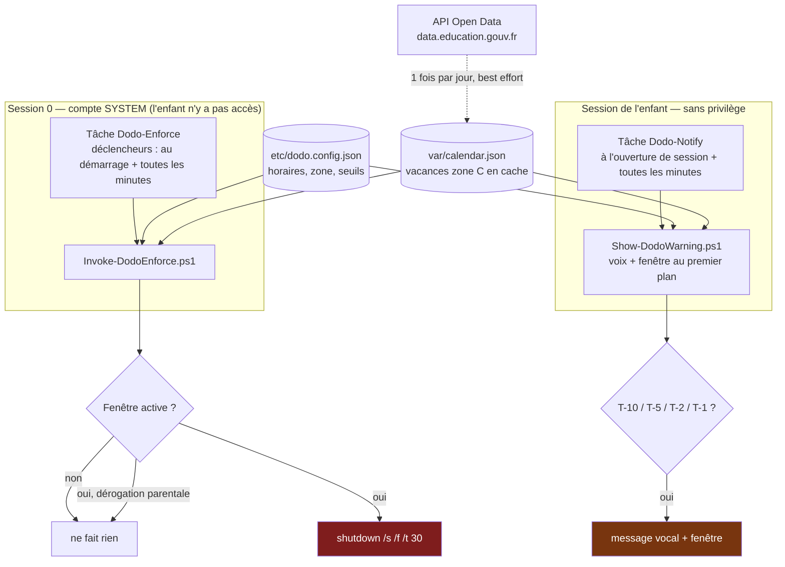
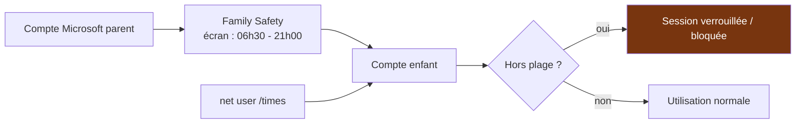
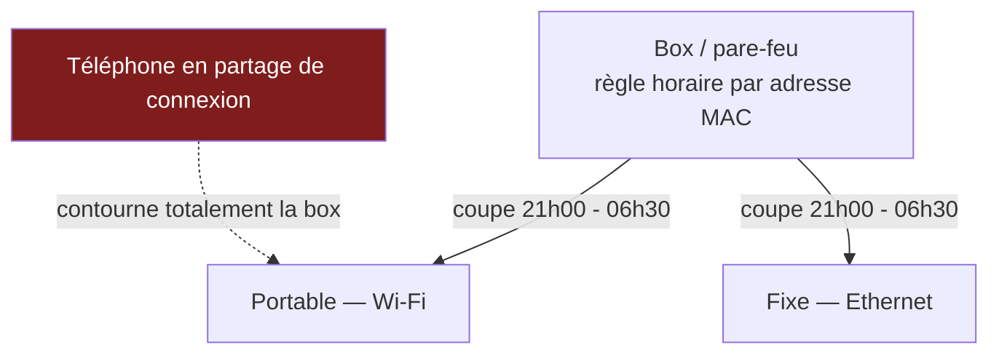
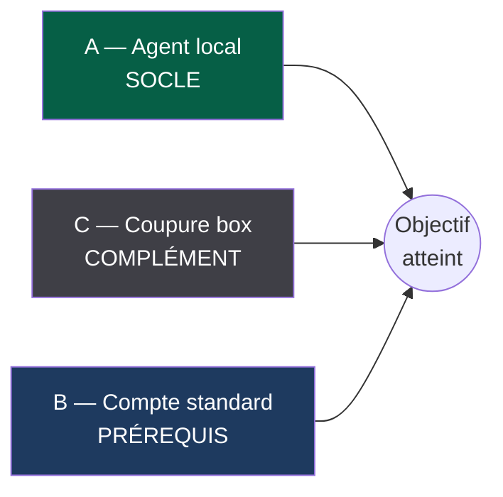

# Trois solutions comparées

> Besoin : les postes de l'enfant (un portable Wi-Fi, un fixe Ethernet) doivent être
> **éteints** de 21h00 à 06h30 en période scolaire et de 23h00 à 06h30 pendant les
> vacances scolaires **zone C**, avec un **message vocal et des rappels à l'écran
> 10 minutes avant**, une règle qui **résiste au redémarrage**, et **pas de partage de
> connexion depuis le téléphone** sur le portable.

---

## Solution A — Agent local sur chaque poste ✅ *(retenue et implémentée ici)*

Un service planifié tourne sous le compte **SYSTEM** sur chaque PC. Toutes les minutes
il compare l'heure courante à la fenêtre applicable et éteint le poste le cas échéant.
Un second agent, sans privilège, tourne dans la session de l'enfant pour parler et
afficher les rappels.

**Ce que ça couvre**

| Exigence | Comment |
|---|---|
| Extinction réelle | `shutdown /s /f` émis par SYSTEM |
| Portable **et** fixe | Aucune dépendance réseau : la décision est prise localement |
| Résiste au redémarrage | Déclencheur « au démarrage » + répétition d'une minute ; si le poste rallume dans la fenêtre, il se rééteint |
| Préavis 10 min + rappels | Seuils 10 / 5 / 2 / 1 min, voix + fenêtre au premier plan |
| Vacances zone C | Calendrier officiel récupéré automatiquement, avec repli strict si indisponible |
| Pas de partage de connexion | Filtre SSID Wi-Fi (`netsh wlan`) + désactivation de toute carte réseau non recensée |

**Limites assumées** — voir [03-exploitation.md](03-exploitation.md#limites-connues-et-risques-résiduels) :
le **mode sans échec** de Windows n'exécute pas les tâches planifiées, et tout repose
sur le fait que **l'enfant n'est pas administrateur**.

---

## Solution B — Windows natif, sans une ligne de code

Deux mécanismes fournis par Microsoft, cumulables :

1. **Microsoft Family Safety** (compte Microsoft parent + enfant) : limites de temps
   d'écran par appareil, avec plage horaire par jour de semaine.
2. **Plages horaires d'ouverture de session** sur un compte local :
   `net user Malo /times:L-D,06:30-21:00`.

| Point fort | Point faible |
|---|---|
| Zéro maintenance, zéro script | **Ne coupe pas le PC** : l'écran reste allumé, session verrouillée seulement |
| Intégré, supporté par Microsoft | **Aucun préavis vocal** à 10 minutes |
| Rapports d'usage pour le parent | **Ne connaît pas les vacances zone C** : il faut modifier la plage à la main 5 fois par an |
| | Family Safety exige des comptes Microsoft et une connexion Internet régulière |
| | Le comportement de `net user /times` sur une **ouverture de session interactive locale** (hors domaine) doit être vérifié poste par poste — ne le tenez pas pour acquis |

**Verdict** : insuffisant seul face à votre besoin (le PC doit s'**éteindre**), mais
excellent en **défense en profondeur**. Le seul élément vraiment indispensable de
cette solution est son prérequis : **le compte de l'enfant doit être un compte
standard, pas administrateur**.

---

## Solution C — Coupure côté réseau (box, routeur ou pare-feu)

Le contrôle parental de la box (Livebox, Freebox, Bbox, SFR) ou une règle de pare-feu
(pfSense / OPNsense) coupe l'accès Internet des deux machines selon un calendrier, par
adresse MAC.

| Point fort | Point faible |
|---|---|
| Aucun logiciel sur les PC | **N'éteint pas le PC** : jeux hors ligne, vidéos locales, l'écran reste allumé |
| Un seul point d'administration | Le **partage de connexion du téléphone** contourne la box de bout en bout |
| Couvre aussi consoles et tablettes | La **randomisation d'adresse MAC** du Wi-Fi Windows peut casser les règles par MAC |
| Aucun préavis possible | Sur Ethernet, l'adresse MAC reste usurpable |

**Verdict** : très bon **complément** (il coupe Internet pour tout le foyer selon un
horaire), jamais un substitut.

---

## Recommandation

1. **Prérequis (solution B)** — le compte de l'enfant est un **compte standard**.
   Sans cela, aucune des trois solutions ne tient : un administrateur désactive tout.
2. **Socle (solution A)** — c'est ce que livre ce dépôt. Identique sur le portable et
   sur le fixe, indépendant du réseau, avec préavis vocal et résistance au redémarrage.
3. **Complément (solution C)** — ajoutez une règle horaire sur la box.
   Ceinture et bretelles : si l'agent tombe, Internet est quand même coupé.

Le point 1 est le seul non négociable. Les points 2 et 3 se renforcent mutuellement.
