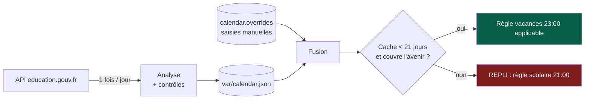
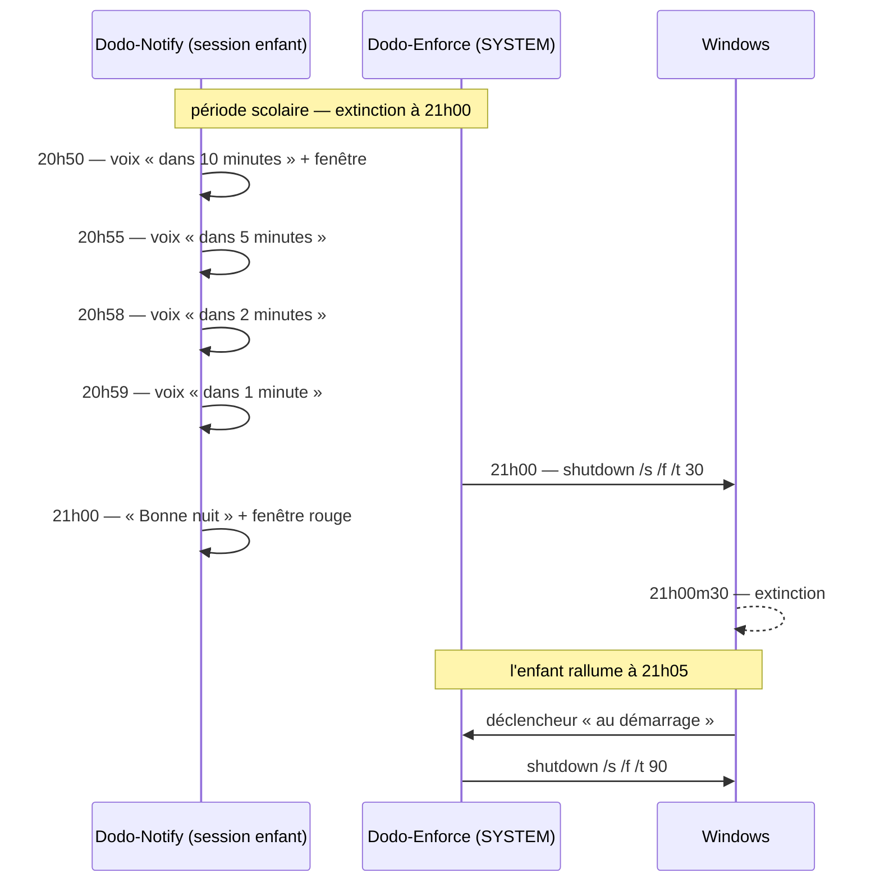

# Exploitation — au quotidien

## Les commandes utiles

| Besoin | Commande *(PowerShell administrateur)* |
|---|---|
| État complet | `Get-DodoStatus.ps1` |
| Prévisionnel sur 3 semaines | `Get-DodoStatus.ps1 -Nights 21` |
| Forcer la mise à jour du calendrier | `Get-DodoStatus.ps1 -Refresh` |
| Autoriser une veillée exceptionnelle | `Add-DodoException.ps1 -Minutes 90 -Reason "anniversaire"` |
| Autoriser jusqu'à une heure précise | `Add-DodoException.ps1 -Until "23:45"` |
| Annuler la dérogation | `Add-DodoException.ps1 -Cancel` |
| Tester le son et la fenêtre | `Show-DodoWarning.ps1 -Force -ForceMinutes 5` |
| Journal du jour | `Get-Content C:\ProgramData\Dodo\logs\dodo-*.log -Tail 40` |
| Journal Windows | *Observateur d'événements → Journaux Windows → Application → source `Dodo`* |

`Add-DodoException.ps1` fait deux choses : il **annule une extinction déjà engagée**
(`shutdown /a`) **et** dépose la dérogation, relue à la minute suivante.

---

## Régler le comportement

Fichier `C:\ProgramData\Dodo\etc\dodo.config.json` — pris en compte à la minute
suivante, sans redémarrage ni réinstallation.

| Clé | Effet |
|---|---|
| `schedule.school` / `schedule.holiday` | Les deux fenêtres, format `HH:mm`. **Le début doit être postérieur à la fin** (la fenêtre passe minuit) — sinon la configuration est refusée. |
| `warningMinutes` | Seuils de préavis, par défaut `[10, 5, 2, 1]` |
| `shutdownGraceSeconds` | Délai entre l'ordre et l'extinction (30 s) |
| `bootGraceSeconds` | Idem, mais dans les 3 minutes suivant un démarrage (90 s) — laisse à un adulte le temps d'ouvrir une session et de poser une dérogation |
| `strictNightBeforeReturn` | `true` : la **veille de la rentrée** repasse en 21:00 |
| `lateEveningsDuringTerm` | `[]` par défaut. Mettre `["Friday","Saturday"]` pour accorder 23:00 les vendredis et samedis soir en période scolaire |
| `exemptUsers` | Comptes devant lesquels on n'éteint pas |
| `calendar.overrides` | Périodes saisies à la main : `{"label":"...","start":"2027-05-06","endExclusive":"2027-05-10"}` — `endExclusive` est le **jour de reprise** |
| `calendar.offlineOnly` | `true` : plus aucun appel réseau, seuls les `overrides` font foi |
| `dryRun` | `true` : tout est journalisé, rien n'est éteint |
| `enabled` | `false` : agent totalement neutralisé |

> **Point à connaître** : tel que vous l'avez demandé, la règle est *période scolaire →
> 21:00*, **week-ends compris**. Un vendredi soir de période scolaire, l'extinction est
> donc à 21:00. Si ce n'est pas ce que vous voulez, renseignez `lateEveningsDuringTerm`.

---

## Comment le calendrier zone C est obtenu

Source : **API Open Data du ministère de l'Éducation nationale**, jeu de données
`fr-en-calendrier-scolaire` sur `data.education.gouv.fr`. Aucune date n'est écrite en
dur dans le code.

**Le repli va toujours dans le sens le plus strict.** Sans réseau, sans cache, avec un
cache périmé ou illisible : c'est 21:00. Le dispositif ne s'ouvre jamais tout seul.

Trois particularités **réelles** du jeu de données, traitées explicitement :

- des enregistrements `population = "Enseignants"` avec des dates différentes de
  celles des élèves → **exclus** ;
- des périodes de **durée nulle** (`start_date == end_date`), par exemple le
  *Pont de l'Ascension* 2026-2027 → **ignorées**, avec avertissement dans le journal.
  Conséquence : ces jours-là sont traités comme des jours d'école (21:00), donc du bon
  côté ; ajoutez-les dans `calendar.overrides` si vous voulez 23:00 ;
- des entrées `"Début des Vacances d'Été"` **sans date de fin publiée** → la fin est
  déduite au **1er septembre** (`calendar.openEndedSummerEnd`), avec avertissement.

`Get-DodoStatus.ps1` affiche ces avertissements et le **prévisionnel nuit par nuit** :
c'est le moyen de contrôle à privilégier avant chaque période de vacances.

---

## Déroulement d'une soirée type

---

## Limites connues et risques résiduels

Aucun de ces points n'est masqué : traitez-les en connaissance de cause.

| Risque | Réalité | Contre-mesure |
|---|---|---|
| **L'enfant est administrateur** | Il désactive tout en trois clics. C'est le seul scénario qui casse réellement le dispositif. | Compte standard obligatoire. `Test-DodoE2E.ps1 -Phase security` affiche la liste des administrateurs à chaque exécution. |
| **Mode sans échec** | Windows **n'exécute pas les tâches planifiées** en mode sans échec. Le menu de récupération est accessible sans mot de passe (Maj + Redémarrer). | Mot de passe UEFI/BIOS + démarrage USB désactivé. Optionnellement `reagentc /disable` pour couper l'environnement de récupération — **au prix de la perte des outils de réparation Windows**. À décider en connaissance de cause. |
| **Démarrage sur une clé USB / autre OS** | Contourne tout. | Mot de passe UEFI + ordre de démarrage verrouillé. |
| **Changement de l'horloge système** | Un compte standard **ne peut pas** changer l'heure système (privilège réservé aux administrateurs) — vérifiez-le sur votre poste. | Rien à faire. L'agent n'utilise le décalage d'horloge de test que si `dryRun = true`, jamais en production. |
| **Arrêt de l'agent d'alerte** | Il peut tuer `powershell.exe` dans **sa** session : il perd les préavis. | Il ne perd pas l'extinction : elle vient de SYSTEM, hors de sa portée. |
| **`shutdown /a` pendant le décompte** | À vérifier sur votre poste (le comportement dépend des privilèges accordés à la session). | Sans importance : l'agent **réémet l'ordre à la minute suivante** et le journalise en `WARN`. |
| **Randomisation d'adresse MAC Wi-Fi** | Peut casser une règle par MAC sur la box (solution C). | Sans effet sur la solution A, qui ne dépend pas du réseau. |
| **Coupure de courant du PC pendant l'écriture** | Cache calendrier tronqué. | Cache illisible → repli sur la règle scolaire, et rafraîchissement automatique. |

---

## Diagnostic rapide

| Symptôme | Piste |
|---|---|
| Le poste ne s'éteint pas | `Get-DodoStatus.ps1` : `Mode` est-il en `SIMULATION` ? `enabled` est-il à `true` ? Une dérogation est-elle active ? Un `exemptUsers` a-t-il une session ouverte ? |
| Aucun préavis, mais extinction correcte | Tâche `Dodo-Notify` : `Get-ScheduledTaskInfo -TaskPath '\Dodo\' -TaskName 'Dodo-Notify'`. Vérifier `%LOCALAPPDATA%\Dodo\dodo-*.log` dans la session de l'enfant. |
| Fenêtre affichée mais aucun son | `Show-DodoWarning.ps1 -ListVoices` (affiche les voix **OneCore et SAPI**). Puis `-SpeakText "essai"` : la ligne « Voie utilisee » dit exactement ce qui a été employé. Si rien : déposer `media\warning.wav` et `media\shutdown.wav`. |
| Voix anglaise alors que le français est installé | La voix française est du jeu *OneCore* et l'ancienne version ne le lisait pas. `-ListVoices` doit maintenant la lister avec le moteur `OneCore` ; sinon, `-Diagnose` indique si la projection WinRT est disponible sur ce poste. |
| Le message n'est dit qu'une fois | `speech.repeatEverySeconds` est à 0, ou plus grand que `speech.displaySeconds`. Assistant → *Message parlé et voix…* affiche le nombre de diffusions calculé. |
| Extinction à 21:00 alors qu'on est en vacances | `Get-DodoStatus.ps1` → `Calendrier : Fiable`. S'il est `NON`, c'est le repli qui joue : `-Refresh`, ou renseigner `calendar.overrides`. |
| Une carte réseau légitime est désactivée | `Install-Dodo.ps1 -EnableAdapterGuard` pour reconstruire la liste blanche avec le nouveau matériel branché. |
| Texte affiché avec des caractères bizarres | `dodo.messages.json` doit être enregistré en **UTF-8**. |

---

## PV d'intervention

Le journal `C:\ProgramData\Dodo\logs\dodo-AAAAMMJJ.log` est **horodaté, en append seul
et non modifiable par un compte standard**. Chaque décision structurante (extinction,
dérogation, désactivation de carte réseau, repli calendrier) y figure et est doublée
dans le journal Windows *Application*, source `Dodo`. C'est la trace à joindre à un PV
d'intervention.
